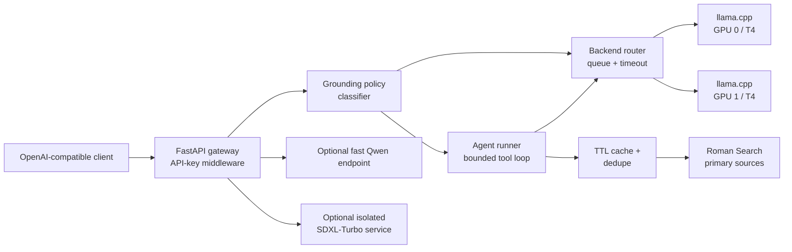

# QwenAPI LLMOps Gateway

QwenAPI is a reviewable extraction of a Kaggle experiment that served a
quantized Qwen model on dual Tesla T4 GPUs and wrapped it with a source-aware,
OpenAI-compatible gateway. The repository focuses on the engineering ideas
that are useful to reuse: policy classification, search grounding, caching,
deduplication, backend boundaries, and safe operational defaults.

> Portfolio note: this is a GPU-serving/LLMOps demonstration, not a promise of
> a production SLA. The original Kaggle notebook remains private and is not a
> dependency of this repository.

## What it demonstrates

- Qwen3.5 4B quantized serving through llama.cpp on two GPU workers.
- Up to four concurrent generation slots, with bounded request timeouts.
- A FastAPI gateway with an OpenAI-compatible `/v1/chat/completions` shape.
- Agentic tool flow: model → `web_search` → Roman Search → model.
- Fail-safe live grounding for legal, medical, financial, cybersecurity,
  government, and public-safety questions.
- Search-result normalization, per-domain deduplication, bounded TTL caching,
  and source metadata suitable for citations.
- Clear extension points for a low-latency model endpoint and isolated image
  generation service.

## Architecture



The editable Mermaid source is in [`docs/architecture.mmd`](docs/architecture.mmd).

## Repository layout

| Path | Purpose |
| --- | --- |
| `src/qwenapi/config.py` | Environment-backed configuration with safe summaries |
| `src/qwenapi/policy.py` | High-stakes category and grounding-policy classifier |
| `src/qwenapi/search.py` | Roman Search adapter, URL canonicalization, cache, dedupe |
| `src/qwenapi/agent.py` | Model-independent bounded agentic orchestration |
| `src/qwenapi/backends.py` | Round-robin adapter for local OpenAI-compatible workers |
| `src/qwenapi/gateway.py` | FastAPI application factory and consistent API auth |
| `notebooks/qwenapi_demo.ipynb` | Sanitized, offline-friendly 8-section walkthrough |
| `tests/` | Standard-library unit tests for policy, cache, dedupe, and agent flow |
| `benchmarks/results.json` | Observed Kaggle experiment numbers, clearly labelled |
| `docs/SECURITY.md` | Threat model, secret handling, and hardening checklist |
| `docs/PORTFOLIO.md` | Résumé bullets and interview talking points |

## Quick start

```powershell
python -m venv .venv
.\.venv\Scripts\Activate.ps1
python -m pip install -r requirements.txt
python -m unittest discover -s tests -v
```

To run the HTTP app after installing dependencies:

```powershell
$env:QWEN_API_KEY = "use-a-rotated-local-key"
uvicorn --factory qwenapi.gateway:create_app --host 127.0.0.1 --port 8000
```

The clean demo intentionally returns a clear “backend adapter not configured”
message until llama.cpp endpoints are supplied. This makes the code safe to
review and test without requiring Kaggle GPUs or exposing a live endpoint.

## Demo notebook

[`notebooks/qwenapi_demo.ipynb`](notebooks/qwenapi_demo.ipynb) contains eight
short sections:

1. Project scope and portfolio framing
2. Architecture and request flow
3. Configuration without secrets
4. High-stakes grounding policy examples
5. Search normalization and cache behavior
6. Mocked agentic tool loop
7. Observed benchmark results
8. Security checklist and next steps

It uses an in-memory mock search provider, so opening it does not make network
requests or require credentials.

## Observed experiment results

The benchmark file records values observed in the private Kaggle run rather
than invented synthetic performance claims. The standout end-to-end run made
12 legal-search calls, collected 46 sources, and completed in about 556 seconds.
Search latency was variable, so these numbers are an operational trace, not a
general throughput benchmark. See [`benchmarks/results.json`](benchmarks/results.json).

## Security status

The original notebook had saved historical output containing a full API key.
Those credentials must be rotated/revoked before any public release of the
Kaggle notebook or a live deployment. This repository contains no real keys.
Review [`docs/SECURITY.md`](docs/SECURITY.md) before connecting a model backend,
Cloudflare Tunnel, or search provider.

## Portfolio attribution

The original implementation was developed with AI-assisted coding agents. The
portfolio claim is that I specified the system requirements, directed the
implementation, reviewed the generated changes, validated behavior, and
operated the resulting service. That is more accurate than claiming every line
was typed manually.
